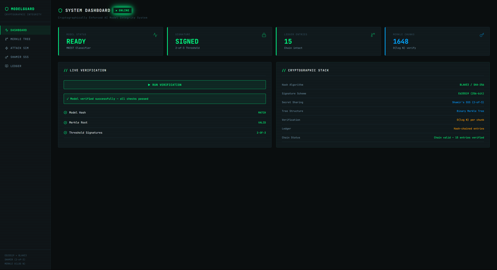
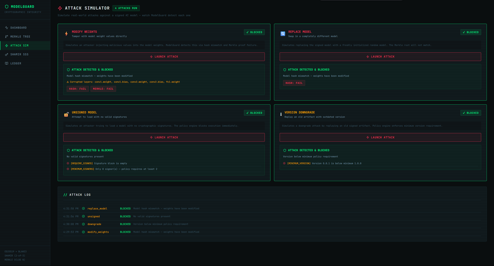
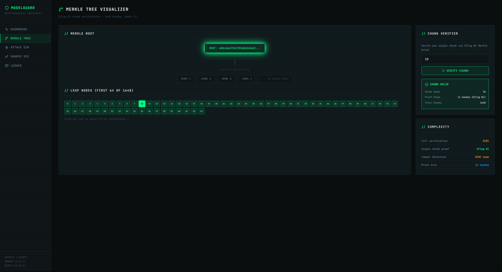
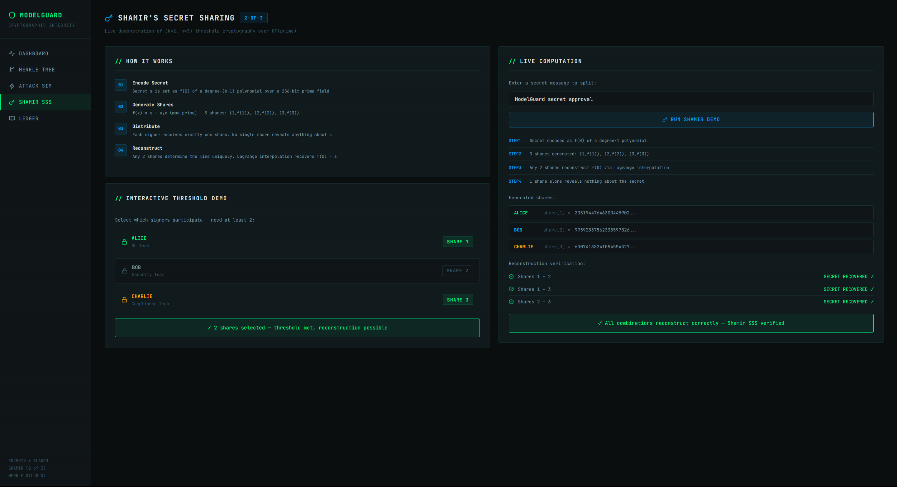
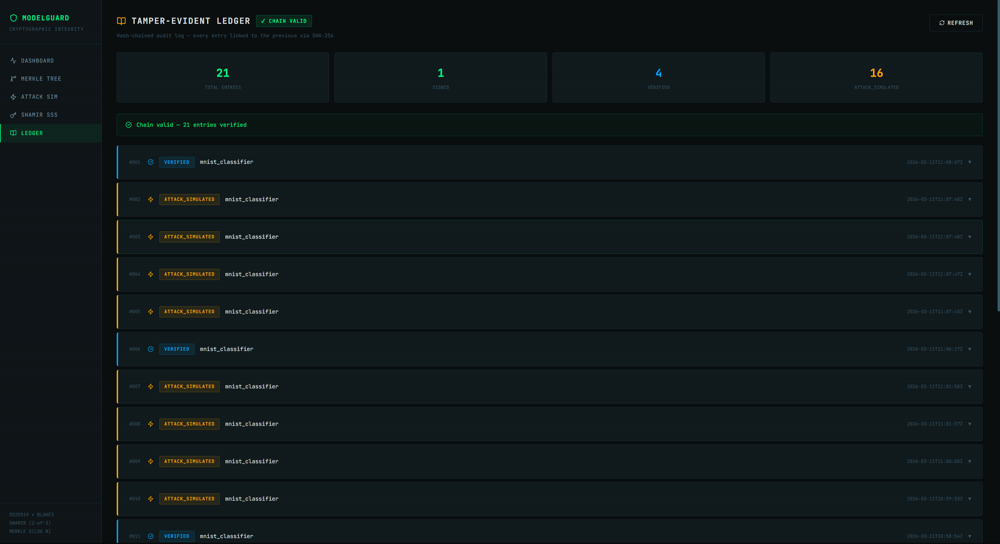

# ModelGuard

> Cryptographically Enforced AI Model Integrity and Provenance System

ModelGuard introduces a cryptographic enforcement layer that guarantees an AI model **cannot execute** unless it passes full cryptographic verification. Built for a graduate Applied Cryptography course.



---

## Live Demo

| | Link |
|---|---|
| **Frontend** | [model-guard-zeta.vercel.app](https://model-guard-zeta.vercel.app) |
| **Backend API** | [modelguard.onrender.com](https://modelguard.onrender.com) |
| **API Docs** | [modelguard.onrender.com/docs](https://modelguard.onrender.com/docs) |

> **Note:** Backend is hosted on Render free tier — first request may take 30-50 seconds to wake up if inactive.

---

## The Problem

AI frameworks like PyTorch load models with zero verification:
```python
model = torch.load("model.pt")  # blindly trusted
```

This means a model file can be silently:
- Modified (malicious weight injection)
- Replaced (wrong model deployed)
- Downgraded (vulnerable version replayed)
- Unsigned (no provenance at all)

**ModelGuard closes this gap with a cryptographic gate between model file and execution.**

---

## Cryptographic Novelty

### 1. Merkle Tree over Model Weights — O(log N) Verification
The model is split into 1648 chunks. A binary Merkle tree is built over their hashes. Any single chunk can be verified in **O(log N)** instead of rehashing the full model O(N). This also enables incremental inference-time verification — only re-check chunks that may have changed.

### 2. Shamir's Secret Sharing — 2-of-3 Threshold Signatures
No single party can approve a model unilaterally. Using a degree-1 polynomial over a 256-bit prime field:
```
f(x) = secret + a₁x  (mod prime)
shares: (1, f(1)), (2, f(2)), (3, f(3))
```

Any 2 of 3 shares reconstruct `f(0) = secret` via Lagrange interpolation. One share alone reveals nothing.

### 3. Execution Gate Architecture
Models must pass **three sequential checks** before execution is allowed:
```
Model File
    ↓
Hash Verification     (BLAKE3 / SHA-256)
    ↓
Merkle Root Check     (O(log N) proof)
    ↓
Threshold Signatures  (Ed25519, 2-of-3)
    ↓
Policy Engine         (version, expiry, revocation)
    ↓
ALLOW or BLOCK
```

### 4. Tamper-Evident Ledger
Every signing, verification, and attack attempt is recorded in a hash-chained ledger. Entries are linked via `hash(prev_entry + current_entry)` — tampering with history breaks the chain.

---

## Attack Simulator



ModelGuard detects and blocks all four attack scenarios:

| Attack | Detection Method | Result |
|--------|-----------------|--------|
| Modify Weights | Hash mismatch + Merkle proof failure | BLOCKED |
| Replace Model | Merkle root mismatch | BLOCKED |
| Unsigned Model | Policy engine — no signatures | BLOCKED |
| Version Downgrade | Policy engine — minimum version | BLOCKED |

---

## Merkle Tree Visualizer



Visual representation of all 1648 weight chunks. Click any chunk to verify it via O(log N) Merkle proof. Selected chunk lights up green (valid) or red (tampered).

---

## Shamir's Secret Sharing Demo



Live demonstration of the polynomial interpolation. Enter any secret, watch it split into 3 shares, then reconstruct from any 2 combinations. Toggle signers to see threshold enforcement in real time.

---

## Ledger



Full audit trail of all model events with hash-chained integrity. Click any entry to inspect its SHA-256 hash, prev_hash linkage, Merkle root, and metadata.

---

## Tech Stack

| Layer | Technology |
|-------|-----------|
| Model | PyTorch — MNIST CNN (421,642 params, 98.79% accuracy) |
| Hashing | BLAKE3 (primary), SHA-256 (fallback) |
| Signatures | Ed25519 via PyNaCl |
| Secret Sharing | Shamir's SSS — pure Python over GF(prime) |
| Backend | FastAPI + Uvicorn |
| Frontend | React + Vite |

---

## Complexity Analysis

| Operation | Naive | ModelGuard |
|-----------|-------|-----------|
| Full model verification | O(N) | O(N) one-time |
| Single chunk verification | O(N) | **O(log N)** |
| Inference-time check (k chunks) | O(N) | **O(k log N)** |
| Tamper localization | O(N) | O(N) scan + O(log N) proof |

---

## Running Locally

### Backend
```bash
cd backend
python -m venv venv
venv\Scripts\activate        # Windows
pip install -r requirements.txt

# Train and sign the MNIST model
cd ..
python -m backend.models.train

# Start API server
uvicorn backend.api.main:app --reload --port 8000
```

### Frontend
```bash
cd frontend
npm install
npm run dev
# Open http://localhost:5173
```

---

## Project Structure
```
ModelGuard/
├── backend/
│   ├── crypto/
│   │   ├── merkle.py       # Merkle tree, O(log N) verification
│   │   ├── threshold.py    # Shamir's SSS + 2-of-3 threshold sigs
│   │   ├── hasher.py       # BLAKE3/SHA-256 utilities
│   │   └── signer.py       # Main signing/verification pipeline
│   ├── core/
│   │   ├── loader.py       # Secure model loader + inference guard
│   │   ├── policy.py       # Policy enforcement engine
│   │   ├── ledger.py       # Tamper-evident hash-chained ledger
│   │   └── provenance.py   # Provenance metadata store
│   ├── models/
│   │   ├── mnist_model.py  # CNN architecture
│   │   └── train.py        # Training + signing pipeline
│   └── api/
│       └── main.py         # FastAPI REST endpoints
└── frontend/
    └── src/
        ├── pages/          # Dashboard, Merkle, Attacks, Shamir, Ledger
        └── components/     # Shared UI components
```

---

## Cryptographic Primitives

- **SHA-256 / BLAKE3** — collision-resistant hash functions for integrity
- **Ed25519** — 256-bit elliptic curve signatures for authenticity  
- **Shamir's Secret Sharing** — (k,n) threshold scheme over GF(2²⁵⁶)
- **Merkle Trees** — binary hash trees for efficient membership proofs
- **Hash Chaining** — linked integrity for tamper-evident audit logs